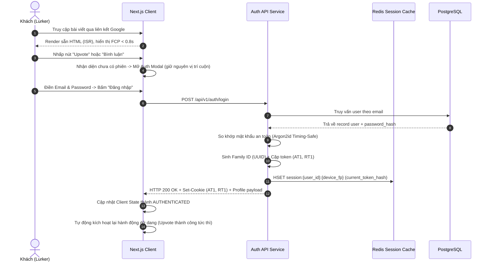
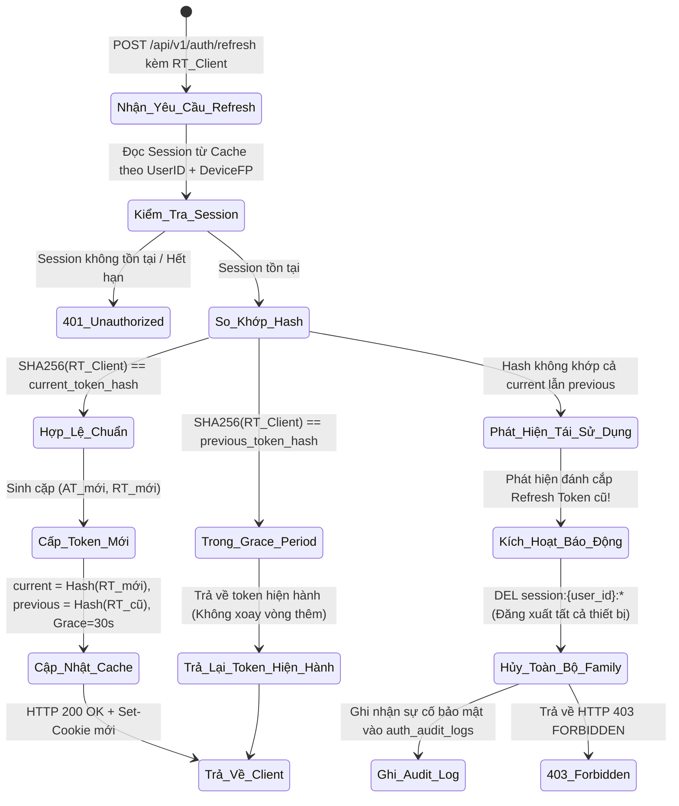

# TÀI LIỆU ĐẶC TẢ YÊU CẦU SẢN PHẨM (PRD) - GIAI ĐOẠN 1
**Dự án:** Nền tảng Mạng Xã Hội & Diễn Đàn Cộng Đồng Hiện Đại (Acad DevOps Project)  
**Phiên bản:** 1.0.0 (MVP Release)  
**Trạng thái:** Approved  

---

## 1. TỔNG QUAN & MỤC TIÊU CHIẾN LƯỢC (CONTEXT & OKRs)

### 1.1. Tuyên ngôn Sản phẩm (Product Vision)
Xây dựng một nền tảng diễn đàn thảo luận kỹ thuật và mạng xã hội cộng đồng hiện đại, kết hợp sức mạnh phân tầng thảo luận sâu (kiểu Reddit/Discourse) và bảng tin tương tác phản hồi tức thì (kiểu X/Bluesky). Nền tảng được tối ưu tuyệt đối cho công cụ tìm kiếm (SEO) để kéo lượng truy cập tự nhiên, đồng thời cung cấp trải nghiệm tương tác thời gian thực không độ trễ (Zero-lag UI), bảo mật dữ liệu cấp doanh nghiệp và kiểm duyệt minh bạch.

### 1.2. Thước đo Định hướng Cốt lõi (North Star Metric)
- **Weekly Meaningful Discussions (WMD):** Tổng số lượng chủ đề thảo luận có chất lượng được tạo mới hoặc tiếp diễn trong tuần (được định nghĩa là các bài viết nhận từ **5 bình luận giá trị trở lên**).

### 1.3. Mục tiêu Kinh doanh & Kỹ thuật (OKRs)
1. **Tỉ lệ giữ chân tuần 4 ($W_4\text{ Retention}$):** $\ge 25\%$ đối với người dùng đã tạo tài khoản.
2. **Tỉ lệ đóng góp nội dung (Creator-to-Consumer Ratio):** $\ge 8\%$ người dùng hoạt động hàng tháng (MAU) có xuất bản bài viết hoặc bình luận.
3. **Hiệu quả lập chỉ mục SEO (Search Engine Indexing):** $\ge 80\%$ bài viết công khai được Googlebot thu thập và lập chỉ mục trong vòng 48 giờ kể từ khi xuất bản.
4. **Hiệu năng giao diện (Core Web Vitals):**
   - **LCP (Largest Contentful Paint):** $< 1.2\text{s}$ trên kết nối 4G tiêu chuẩn.
   - **CLS (Cumulative Layout Shift):** $= 0$.
   - **INP (Interaction to Next Paint):** $< 100\text{ms}$.
5. **Độ tin cậy hạ tầng (System Reliability):** Uptime cam kết đạt **99.9%**, chịu tải tức thời tối thiểu **5.000 RPS** mà không suy hao hiệu năng.

---

## 2. CHÂN DUNG NGƯỜI DÙNG & TÌNH HUỐNG SỬ DỤNG (PERSONAS & JOBS-TO-BE-DONE)

```text
┌─────────────────────────────────────────────────────────────────────────────┐
│                       PHÂN BỔ TỈ LỆ NGƯỜI DÙNG CỘNG ĐỒNG                    │
├─────────────────────────────────────────────────────────────────────────────┤
│  [ The Lurker: ~80% ]        [ The Contributor: ~15% ]   [ The Mod: ~5% ]   │
│  - Tìm kiếm qua Google       - Soạn thảo bài viết dài    - Quản lý Mod Queue│
│  - Đọc thụ động, không login - Bình luận, tranh luận     - Khóa spam, ban user│
│  - Cần tốc độ tải < 1s       - Tích lũy điểm Karma       - Bảo vệ không gian│
└─────────────────────────────────────────────────────────────────────────────┘
```

### 2.1. The Lurker (Người đọc thầm lặng - ~80%)
- **Hành vi:** Đến từ kết quả tìm kiếm Google hoặc liên kết mạng xã hội; đọc bài giải quyết vấn đề kỹ thuật; hiếm khi đăng nhập trừ khi muốn lưu bài hoặc upvote.
- **Nhu cầu chính:** Trang bài viết tải tức thì (FCP < 0.8s), giao diện mobile không quảng cáo che khuất, cuộn mượt mà qua các đoạn code mẫu và cây thảo luận.

### 2.2. The Contributor (Người tích cực thảo luận - ~15%)
- **Hành vi:** Chia sẻ kiến thức, viết bài hướng dẫn chuyên sâu, đặt câu hỏi và phản hồi bình luận.
- **Nhu cầu chính:** Trình soạn thảo Markdown/Rich-text mạnh mẽ, tự động lưu bản nháp (auto-draft), kéo thả tải ảnh tốc độ cao không gián đoạn, nhận thông báo tức thời khi có ai trả lời và tích lũy uy tín (Karma).

### 2.3. The Curator / Moderator (Quản trị viên cộng đồng - ~5%)
- **Hành vi:** Giữ gìn trật tự trong Space, duyệt bài bị gắn cờ, xử phạt thành viên vi phạm quy tắc.
- **Nhu cầu chính:** Hàng đợi kiểm duyệt (Mod Queue) tinh gọn, thao tác nhanh 1-click (khóa thread, ẩn bình luận, mute thành viên, cảnh báo), lưu vết kiểm toán minh bạch (Audit Logs).

---

## 3. ĐẶC TẢ TÍNH NĂNG CHỨC NĂNG (FUNCTIONAL REQUIREMENTS - MoSCoW)

### 3.1. Must-Have (Bắt buộc cho MVP)
- **Module Auth & Session (Trọng tâm cốt lõi):**
  - Đăng ký và Đăng nhập bằng Email/Password (băm bằng Argon2id).
  - Quản lý phiên bằng Giao thức Token Rotation kép: Access Token (15m, httpOnly Cookie) + Refresh Token (7d, httpOnly Cookie) kèm Grace Period 30s chống xung đột mạng.
  - Tự động phát hiện tấn công tái sử dụng Refresh Token (Token Reuse Detection) và lập tức thu hồi toàn bộ Session Family.
  - Phân quyền kép RBAC (Guest, Member, Space Mod, Admin) kết hợp ABAC (tuổi tài khoản < 7 ngày, điểm Karma).
  - Client Interceptor với Mutex Lock chống gọi lặp API refresh token.
- **Module Content (CMS):**
  - Trình soạn thảo văn bản Tiptap hỗ trợ Headings, Code Blocks, Blockquotes, Danh sách, Mentions.
  - Tải ảnh trực tiếp lên Cloudflare R2 / Object Storage qua Presigned URL (Zero-Hop Upload), kiểm định MIME thực tế và mã băm Blurhash.
  - Kiểm định cây Abstract Syntax Tree (JSON AST) ở máy chủ để triệt tiêu XSS.
- **Module Interaction:**
  - Bảng tin với các bộ lọc phân trang con trỏ (Cursor-based): `Hot` (Gravity Decay) và `New` (Thời gian).
  - Cây bình luận đa tầng (Nested Comments) lưu trữ bằng PostgreSQL `ltree` Base36, hỗ trợ sâu tối đa 8 cấp.
  - Cơ chế Bầu chọn (Upvote/Downvote) xử lý đệm ghi chậm qua Redis với độ phức tạp $\mathcal{O}(1)$ và cập nhật giao diện lạc quan (Optimistic UI).
- **Module Notification & Realtime:**
  - Kênh Server-Sent Events (SSE) đẩy số liệu vote và thông báo mới.
  - Thuật toán gom cụm thông báo theo cửa sổ trượt 5 phút (Sliding Window Aggregator).

### 3.2. Should-Have (Giai đoạn V1.1)
- Đăng nhập một chạm OAuth 2.0 (Google, GitHub) tích hợp vào bảng `user_identities`.
- Tìm kiếm toàn văn nhanh qua Meilisearch với gợi ý từ khóa tức thì (Typeahead).
- Hệ thống huy hiệu (Badges) gắn theo các mốc điểm danh tiếng.

### 3.3. Could-Have (Giai đoạn V1.2)
- Đăng nhập không cần mật khẩu (Magic Link, Passkeys / WebAuthn).
- Tùy biến luật lệ chi tiết cho từng Space riêng biệt.
- Chat trực tiếp hai chiều (1-1 Direct Messaging) qua WebSocket.

### 3.4. Won't-Have (Không làm trong MVP)
- Thu phí thành viên, cổng thanh toán hoặc ví điện tử.
- Ứng dụng di động bản địa (Native Mobile Apps) – MVP tập trung tối ưu Mobile Web Responsive (PWA).

---

## 4. ĐẶC TẢ YÊU CẦU PHI CHỨC NĂNG (NON-FUNCTIONAL REQUIREMENTS)

### 4.1. Hiệu năng & Tối ưu hóa (Performance)
- **Tốc độ phản hồi API:** $P95 < 80\text{ms}$ cho các truy vấn đọc qua Cache, $P95 < 200\text{ms}$ cho các truy vấn ghi dữ liệu vào PostgreSQL.
- **Tối ưu hóa DOM:** Không bao giờ render quá 30 DOM elements thực tế trên màn hình danh sách bình luận (sử dụng kỹ thuật ảo hóa DOM `@tanstack/react-virtual`).

### 4.2. Khả năng Chịu tải & Mở rộng (Scalability & Availability)
- **Không điểm nghẽn đơn lẻ (No Single Point of Failure):** Tách biệt tầng Stateless Services (Web Client, Core API) khỏi Stateful Services (PostgreSQL, Redis).
- **Phân tách Cache & State:** Cụm Redis cho Cache (Volatile) chạy chính sách `allkeys-lru`; cụm Redis cho Session & Queue (Persistent) bật sao lưu AOF và tắt cơ chế eviction (`noeviction`).

### 4.3. Tiêu chuẩn An ninh & Bảo mật (Security Standards)
- **Bảo vệ Cookie:** Toàn bộ authentication cookies phải có cờ `HttpOnly`, `Secure`, và `SameSite` phù hợp (`Lax` cho Access Token, `Strict` cho Refresh Token).
- **Bảo vệ XSS & Injection:** Mọi nội dung bài viết chỉ lưu trữ dưới dạng cấu trúc cây JSON AST đã qua kiểm định schema chặt chẽ; không cho phép chèn thẻ `<script>` hay HTML tùy ý.
- **Kiểm soát Tần suất (Rate Limiting):** Áp dụng thuật toán Token Bucket ở tầng Reverse Proxy / API Gateway: tối đa 5 lần thử đăng nhập/phút trên một địa chỉ IP.

---

## 5. SƠ ĐỒ LUỒNG NGƯỜI DÙNG CỐT LÕI (CORE USER FLOWS)

### Luồng 1: Tiếp cận từ Tìm kiếm, Trải nghiệm & Đăng nhập (Guest to Onboarded User)



### Luồng 2: Chu trình Làm mới Token & Phát hiện Tấn công (Token Rotation & Reuse Detection)



---

## 6. MA TRẬN PHÂN QUYỀN TOÀN DIỆN (RBAC + ABAC)

### 6.1. Cấu trúc Bậc Vai trò Cố định (RBAC Hierarchy)
1. **GUEST:** Người truy cập chưa đăng nhập. Chỉ có quyền đọc nội dung công khai.
2. **USER (Member):** Người dùng đã đăng ký và xác thực tài khoản.
3. **SPACE_MOD:** Điều hành viên được giao quyền quản trị một hoặc nhiều Không gian thảo luận cụ thể.
4. **GLOBAL_MOD:** Điều hành viên toàn sàn phụ trách kiểm duyệt vi phạm diện rộng.
5. **ADMIN:** Quản trị viên hệ thống có toàn quyền cấu hình và xử phạt.

### 6.2. Quy tắc Ràng buộc Thuộc tính Động (ABAC Rules)
- **Rule 1 (Slow-down Barrier):** Tài khoản mới có tuổi đời $< 7$ ngày chỉ được đăng tối đa 2 bài viết/ngày và cách nhau ít nhất 60 giây giữa 2 lần bình luận.
- **Rule 2 (Karma Gate for Downvoting):** Tính năng Downvote bị khóa đối với người dùng có Karma $< 500$. Khi thực hiện Downvote, tài khoản bị trừ $-1$ điểm Karma để ngăn chặn việc lạm dụng dìm bài viết.
- **Rule 3 (Content Edit Lockout):** Tác giả chỉ được chỉnh sửa nội dung bài viết trong vòng 24 giờ kể từ thời điểm đăng bài. Sau 24 giờ, bài viết tự động chuyển sang chế độ bất biến (Immutable).
- **Rule 4 (Space Boundary Enforcement):** Space Moderator chỉ có thẩm quyền duyệt bài, khóa thread và xử phạt trong phạm vi các Space mà họ được phân công.
- **Rule 5 (New Space Creation):** Yêu cầu tài khoản có thâm niên tối thiểu 30 ngày và điểm Karma $\ge 500$ mới được tạo Không gian thảo luận mới.
