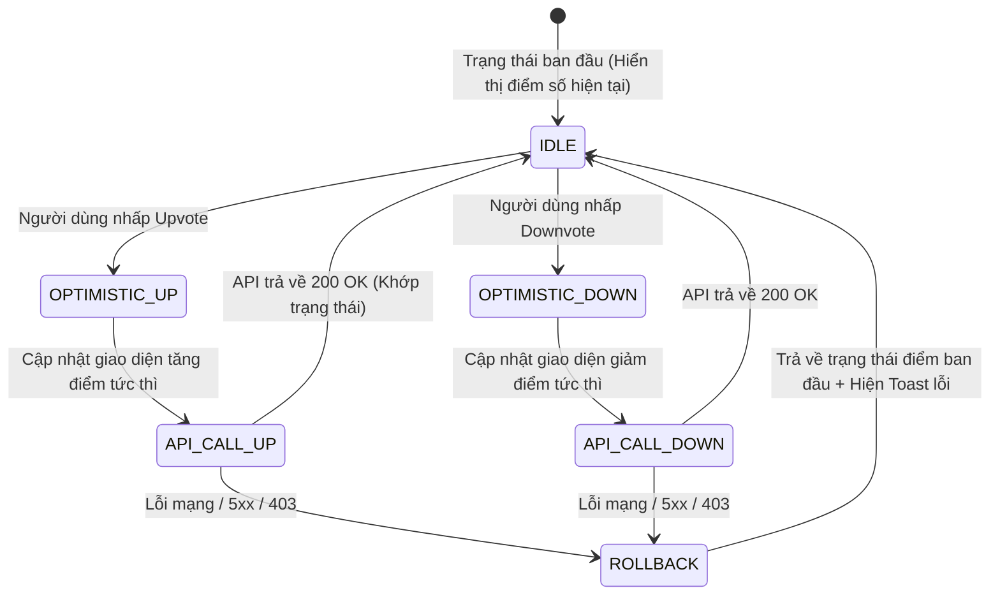

# ĐẶC TẢ HỆ THỐNG GIAO DIỆN UI/UX & MÁY TRẠNG THÁI (GIAI ĐOẠN 2)
**Phân hệ:** Frontend Design System, RSC Architecture & UI State Machines  
**Mục tiêu:** Tối ưu hóa SEO tuyệt đối (FCP < 0.8s) kết hợp trải nghiệm tương tác thời gian thực không độ trễ (Zero-lag UI)  

---

## 1. MA TRẬN THIẾT KẾ HỆ THỐNG (DESIGN SYSTEM TOKENS)

### 1.1. Lưới Bố cục & Điểm ngắt (Grid System & Breakpoints)
- **Base Unit:** $4\text{px}$
- **Breakpoints:**
  - `mobile_sm`: $360\text{px}$
  - `mobile_lg`: $480\text{px}$
  - `tablet`: $768\text{px}$
  - `desktop_sm`: $1024\text{px}$
  - `desktop_lg`: $1280\text{px}$
  - `desktop_xl`: $1536\text{px}$
- **Khung hiển thị tối đa:** $1440\text{px}$
- **Số cột (Columns):** Mobile: 4, Tablet: 8, Desktop: 12

### 1.2. Thang Đo Kiểu Chữ (Typography Scale)
- **Font Sans:** `Inter, -apple-system, BlinkMacSystemFont, "Segoe UI", Roboto, sans-serif`
- **Font Mono:** `"JetBrains Mono", "Fira Code", monospace`
- **Thang kích thước:**
  - `display`: $36\text{px}$ (line-height: $44\text{px}$, weight: 800)
  - `h1`: $30\text{px}$ (line-height: $38\text{px}$, weight: 700)
  - `h2`: $24\text{px}$ (line-height: $32\text{px}$, weight: 700)
  - `h3`: $20\text{px}$ (line-height: $28\text{px}$, weight: 600)
  - `body_lg`: $16\text{px}$ (line-height: $24\text{px}$, weight: 400)
  - `body_md`: $14\text{px}$ (line-height: $20\text{px}$, weight: 400)
  - `body_sm`: $12\text{px}$ (line-height: $16\text{px}$, weight: 400)
  - `caption`: $11\text{px}$ (line-height: $14\text{px}$, weight: 500)

### 1.3. Bảng Màu Ngữ Nghĩa (Light & Dark Palette Semantics)
```text
┌──────────────────────┬──────────────────────┬──────────────────────┐
│ Token Semantic       │ Chế độ Sáng (Light)  │ Chế độ Tối (Dark)    │
├──────────────────────┼──────────────────────┼──────────────────────┤
│ surface_canvas       │ #F8FAFC (Slate 50)   │ #0B0F17 (Dark Navy)  │
│ surface_elevated_1   │ #FFFFFF (Pure White) │ #131926 (Card Dark)  │
│ surface_elevated_2   │ #F1F5F9 (Slate 100)  │ #1E2638 (Hover Dark) │
│ border_subtle        │ #E2E8F0 (Slate 200)  │ #242F45              │
│ text_primary         │ #0F172A (Slate 900)  │ #F8FAFC (Slate 50)   │
│ text_secondary       │ #475569 (Slate 600)  │ #94A3B8 (Slate 400)  │
│ text_muted           │ #94A3B8 (Slate 400)  │ #64748B (Slate 500)  │
│ brand_primary        │ #2563EB (Blue 600)   │ #3B82F6 (Blue 500)   │
│ vote_up              │ #EA580C (Orange 600) │ #F97316 (Orange 500) │
│ vote_down            │ #4F46E5 (Indigo 600) │ #6366F1 (Indigo 500) │
│ status_danger        │ #DC2626 (Red 600)    │ #EF4444 (Red 500)    │
│ status_success       │ #16A34A (Green 600)  │ #22C55E (Green 500)  │
└──────────────────────┴──────────────────────┴──────────────────────┘
```

---

## 2. BỐ CỤC KHUNG NHÌN 3 CỘT (SCREEN LAYOUT BLUEPRINT)

```text
Viewport [100vw, 100vh]
  │
  ├── TopNavbar [Fixed, Height: 56px, z-index: 50]
  │     ├── Trái: [Logo] + [SpaceSelector Dropdown]
  │     ├── Giữa: [Global Search Bar (Debounced Cmd+K)]
  │     └── Phải: [Create Post] + [Notifications (SSE Badge)] + [User Menu]
  │
  └── MainContainer [Max-W: 1440px, Display: Flex, Margin: 0 auto]
        │
        ├── LeftRailNavigation [Sticky, Width: 240px, Height: calc(100vh - 56px)]
        │     ├── Nhóm 1: [Trang chủ, Thịnh hành, Khám phá Spaces]
        │     ├── Nhóm 2: [Danh sách Spaces đang theo dõi - Infinite Scroll]
        │     └── Nhóm 3: [Quy tắc, Trợ giúp, Điều khoản]
        │
        ├── CenterContentStage [Flex: 1, Max-W: 768px, Border-X: 1px subtle]
        │     ├── Tuyến Feed:
        │     │     ├── FilterBar [Sticky: Hot / New / Top]
        │     │     └── VirtualizedFeedStream [InfiniteScroll]
        │     └── Tuyến Chi tiết Bài viết:
        │           ├── ThreadHeader + Breadcrumb Space
        │           ├── ThreadBody (JSON AST Rendered HTML)
        │           ├── InlineInteractionBar [Vote, Comments, Share, Bookmark]
        │           ├── QuickReplyComposer (Tiptap Mini)
        │           └── VirtualizedCommentTree [Dynamic Depth + Guide Lines]
        │
        └── RightRailContextual [Sticky, Width: 320px, Height: fit-content]
              ├── Widget 1: SpaceInfoCard (Thành viên, Luật Space, Nút Tham gia)
              ├── Widget 2: TrendingTopics (Top 5 tags thịnh hành 24h)
              └── Widget 3: ModeratorActionsCard (Chỉ hiện cho Mod/Admin)
```

---

## 3. PHÂN CHIA RANH GIỚI SERVER - CLIENT COMPONENTS (RSC BOUNDARIES)

```text
Trang Chi tiết Bài viết (Thread Detail Page):
  │
  ├── [RSC] Page Shell (Server Component - 0KB JS)
  │     ├── Fetch dữ liệu Thread Detail từ Database
  │     ├── Sinh thẻ Meta Tags, JSON-LD Schema (SEO Indexing)
  │     │
  │     ├── [RSC] ThreadContentStage
  │     │     └── Render tĩnh phần thân bài viết (Zero-runtime markdown)
  │     │
  │     ├── [Client Island] VoteActionButtons
  │     │     └── Quản lý Optimistic UI cho Upvote/Downvote
  │     │
  │     ├── [Client Island] ReplyComposer
  │     │     └── Trình soạn thảo Tiptap, xử lý gõ phím & upload ảnh
  │     │
  │     └── [Client Island] VirtualizedCommentTree
  │           └── Thuật toán trải phẳng mảng & ảo hóa DOM qua @tanstack/react-virtual
```

---

## 4. MÁY TRẠNG THÁI GIAO DIỆN (UI STATECHARTS)

### 4.1. Máy Trạng thái Bầu chọn Lạc quan (Optimistic Voting State Machine)



### 4.2. Máy Trạng thái Điều hướng Liên kết Sâu Bình luận (Deep-Link Navigation)
Khi người dùng truy cập URL dạng `/thread/slug#comment-c58bd21c`:
1. Trích xuất `target_comment_id` từ URL hash.
2. Kiểm tra bộ nhớ Client Cache:
   - Nếu chưa có dữ liệu nhánh đó, tự động gọi API `GET /api/v1/comments/{id}/context` để lấy toàn bộ chuỗi đường dẫn tổ tiên (Parent Path Chain).
3. Tự động xóa chuỗi đường dẫn của các nút cha khỏi `collapsed_paths_set` để bung nhánh ra.
4. Tính toán chỉ số vị trí (Index) tương ứng của `target_comment_id` trong mảng đã trải phẳng.
5. Kích hoạt lệnh cuộn ảo: `virtualizer.scrollToIndex(target_index, { align: 'center' })`.
6. Áp dụng hiệu ứng CSS Highlight viền sáng trong 2.5 giây.
